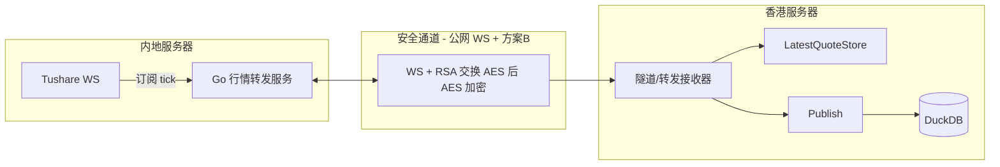

# 内地同步 + 隧道/转发 Tushare 实时行情 — 设计方案

**选定方案**：**方案 3 — 内地 WebSocket 转发 + 安全组白名单 + 应用层加密（方案 B）**。内地域名需备案，**Let's Encrypt 不可用**；改为 **公网 IP 直连 + 安全组仅放行香港 QDHub 服务器 IP**，协议层 **WS（非 WSS）**。应用层加密采用 **方案 B**：**会话建立时用 RSA 交换一次对称密钥（如 AES），后续 tick 流用对称密钥加密**，兼顾性能与安全。

---

## 一、目标与约束

- **目标**：香港服务器上的 QDHub 无法直连 Tushare WS；改为在内地服务器订阅 Tushare，将 tick 数据经安全通道推到香港，由 QDHub 接收并写入 LatestQuoteStore 与 DuckDB（`ts_realtime_mkt_tick`），前端 WebSocket 与现有逻辑不变。
- **约束**：实现采用 **方案 3（公网 WS + 应用层方案 B）**；方案 1（SSH）、方案 2（WireGuard）保留作备选。内地侧为 **独立 Go 行情转发服务端**（基于 `doc/example/rec_realtime.py`、`doc/example/subscribe.py` 设计）；香港侧复用现有 ws_collector 的写 Store + publish 行为及 realtime_jobs 的 db_sink 流水线。
- **不实现**：本文档只做设计，不包含具体代码实现。

---

## 二、整体架构与数据流（通用）

---

## 三、方案 1：SSH 本地转发

- **内地**：Python 订阅 Tushare + 本地转发服务监听 `127.0.0.1:8888`（TCP 或 WS），输出 NDJSON。
- **通道**：香港执行 `ssh -L 127.0.0.1:9999:127.0.0.1:8888 user@mainland`，香港连 `localhost:9999` 即内地 8888；内地仅开放 22，不对外暴露 8888。
- **安全**：SSH 加密 + 密钥认证。

---

## 四、方案 2：WireGuard 点对点

- **内地**：同上，转发服务额外监听 WG 地址（如 `10.0.0.1:8888`）。
- **通道**：两地组网后，香港接收器直连 `10.0.0.1:8888`。
- **安全**：WireGuard 加密；防火墙对 WG 网段放行 8888。

---

## 五、方案 3：内地 WebSocket 转发 + 安全组 + 应用层 RSA 加密（选定方案）

### 5.1 思路

- **内地**：部署基于 **WebSocket** 的转发服务（可与 Python 订阅进程同机或同进程），对外监听**公网 IP + 端口**（如 8888），使用 **WS（非 WSS）**，**不依赖域名与 TLS 证书**。香港 QDHub 通过 `ws://<内地公网IP>:端口/path` 连接。
- **访问控制**：通过 **阿里云安全组** 只放行 **QDHub 所在香港服务器的出口 IP**（即香港 ECS 的公网 IP 或固定出口 IP），其它 IP 一律拒绝，实现“仅 QDHub 服务器可连”。
- **加密策略**：因内地域名需**备案**，**Let's Encrypt 不可用**；故**不采用协议层 TLS**，改为 **应用层加密必选**，采用 **方案 B**：会话建立时用 **RSA 交换一次对称密钥（如 AES）**，后续 **tick 流用该对称密钥加密**，兼顾性能与安全，结合安全组实现合规。

### 5.2 设计要点

| 维度 | 说明 |
|------|------|
| 协议 | 内地以 **WS**（明文 WebSocket）服务端运行，监听公网 IP:端口；香港 QDHub 作为 WebSocket 客户端连接 **ws://<内地公网IP>[:port]/path**。 |
| 安全组 | 内地 ECS 安全组入方向：仅开放 WS 端口（如 8888），来源限制为香港 QDHub 服务器的公网 IP（或该 IP 段）。 |
| 协议层加密 | **不使用**：无域名则无法使用 Let's Encrypt；自签证书 + IP 直连需香港侧跳过验证，不采纳。 |
| 应用层加密 | **必选，采用方案 B**：会话建立时用 **RSA 交换一次对称密钥**（如 AES-256），后续 **tick 流用该对称密钥加密**；内地与香港约定一方生成 AES 密钥、用对方 **RSA 公钥** 加密后发送，对端用私钥解密得到 AES 密钥，此后全量 payload 用 AES 加密/解密。不采用方案 A（全量 RSA），以兼顾性能。 |

### 5.3 与方案 1/2 的差异

- **无需隧道软件**：香港直接连内地公网 IP:端口，不依赖 SSH 或 WireGuard。
- **依赖安全组**：必须正确配置且香港出口 IP 稳定（若会变，需弹性 IP 或固定出口再在安全组放行）。
- **无域名、无 Let's Encrypt**：采用公网传输 + 应用层 RSA 加密，避免备案与证书依赖。

### 5.4 合规与安全

- 仅自有两台服务器之间通信，安全组限制仅 QDHub 服务器可连，符合最小权限。
- 传输安全由**应用层方案 B（RSA 交换 AES + AES 加密 tick 流）**保证；协议层为明文 WS，仅安全组限制可连对象。

### 5.5 为何不用 Let's Encrypt

- **内地域名需备案**：若为内地 ECS 配置公网域名以使用 Let's Encrypt，域名须完成 ICP 备案，流程与周期成本高。
- **Let's Encrypt 依赖域名**：ACME HTTP-01 校验要求域名解析到服务器且 80 端口可访问，无备案域名则不可行。
- **结论**：本方案不申请域名，采用 **公网 IP 直连 + 安全组白名单 + 应用层方案 B（RSA 交换 AES + AES 加密）**，在无协议层 TLS 的前提下由应用层加密保障数据安全。

---

## 六、隧道/转发应用层协议（三种方案统一）

- **格式**：**NDJSON**（每行一个 JSON）或 length-prefixed JSON，便于内地逐条写、香港按行/批解析。
- **单条 payload**：与 QDHub 内 LatestQuoteStore 单条一致（含 `ts_code`、`code`、`trade_time`、`price`、`pre_price` 及五档等）；可选带 `target_db_path`。
- **方案 3（当前选定，方案 B）**：会话建立时完成 **RSA 交换对称密钥**（见上）；此后上述 JSON（或 NDJSON 批）序列化后作为明文，**用会话对称密钥（如 AES）加密**后通过 WS 以 Binary 帧发送；香港用同一对称密钥解密再按同一协议解析。协议层无 TLS。

---

## 七、香港侧接收（三种方案统一）

- **隧道/转发接收器**：实现 DataCollector，数据来源为「连接隧道或 WS 端点并读取协议」；收到 rows 后写 LatestQuoteStore + `publish(DataArrivedPayload)` 驱动 db_sink 落库。
- **方案 3（公网 WS + 方案 B）**：连接地址为内地公网 **ws://<IP>[:port]/path**。建连后先完成 **RSA 交换 AES 密钥**；此后在解析 NDJSON 前**必须先**用会话 AES 密钥对收到的帧解密，再按同一协议解析。
- 若引入多源，在 RealtimeSourceSelector 中增加 `tushare_tunnel`（或 `tushare_ws_forward`）及健康/错误状态。

---

## 八、方案对比小结

| 维度 | 方案 1（SSH） | 方案 2（WireGuard） | 方案 3（公网 WS + RSA，选定） |
|------|----------------|----------------------|----------------------------------|
| 建立方式 | 香港 ssh -L，需保活 | 两地 WG 常驻 | 香港直连内地公网 IP:端口，无需隧道 |
| 访问控制 | SSH 密钥 + 内地仅开 22 | WG 密钥 + 防火墙 | 安全组只放行香港 IP |
| 数据加密 | SSH 通道加密 | WG 加密 | 协议层无 TLS；**应用层方案 B：RSA 交换 AES + AES 加密 tick 流** |
| 运维 | 维护 SSH 会话/autossh | 维护 WG 与路由 | 维护安全组 + RSA 密钥对（用于交换 AES） |
| 适用 | 快速落地、单端口转发 | 多服务复用、低延迟 | 无域名/不备案、公网直连 + 应用层加密、香港出口 IP 稳定 |

---

## 九、行情转发服务端设计（独立 Go 应用）

内地侧 **行情转发服务** 设计为 **独立 Go 应用**（代码路径见 9.4），部署于内地 ECS；行为与协议基于 **Python Tushare 演示脚本** [doc/example/rec_realtime.py](doc/example/rec_realtime.py)、[doc/example/subscribe.py](doc/example/subscribe.py) 的订阅流程与数据形态，用 Go 实现同等能力并增加 WebSocket 服务端与方案 B 加密。

### 9.1 与 Python 演示脚本的对应关系

| Python（subscribe.py / rec_realtime.py） | Go 转发服务端（设计） |
|------------------------------------------|------------------------|
| `TsSubscribe`：连接 `wss://ws.tushare.pro/listening` | **Tushare 客户端模块**：Dial 同上 URL，建立 WS 长连接 |
| `on_open`：发送 `{"action":"listening","token":token,"data":{topic: codes}}` | 建连后发送相同 JSON；topic 默认 `HQ_STK_TICK`，codes 默认 `["3*.SZ","0*.SZ","6*.SH"]`，可配置 |
| `on_message`：解析 `resp.data.topic`、`data.code`、`data.record`；`record` 为单条 tick（数组或对象） | 收到 Tushare 消息后解析 `status`、`data.topic`、`data.code`、`data.record`；将 `record` 归一化为与 QDHub 一致的 row（见下） |
| 每 30s 发送 `{"action":"ping"}` | 同上，保活 ping |
| `data_back(record)` / 注册的回调收到单条 `record` | 每收到一条 record → 归一化 → 可选批量 → 用会话 AES 加密 → 写入下游 WebSocket 客户端 |
| `record` 字段含义（rec_realtime.py 注释）：code/name/trade_time/pre_price/price/open/high/low/close/volume/amount/num/ask_price1~5 等 | **归一化**：与 QDHub [ws_collector.go](qdhub/internal/infrastructure/datasource/tushare/realtime/ws_collector.go) 的 `tushareTickRecordFields` 及 `normalizeTushareTickRecord` 一致；注意 Tushare WS 的 price/pre_price 语义与 QDHub 内交换后一致（见现有实现） |

### 9.2 模块划分（Go 应用）

- **Tushare 客户端**：连接 `wss://ws.tushare.pro/listening`，发送 listening（token、topic、codes），接收消息并解析出 `topic/code/record`；定时 ping；**与 Tushare 断开时自动重连**，采用退避重试，**默认重试上限次数**（如 30 次，可配置；0 表示无上限持续重试），达到上限后不再重连并记录日志/告警。将解析后的 record 交给「归一化 + 下行转发」管道。
- **归一化**：将 Tushare 原始 `record`（数组或 map）转为与 QDHub LatestQuoteStore 单条一致的 `map[string]interface{}`（含 `ts_code`、`code`、`trade_time`、`price`、`pre_price` 及五档等），与现有 ws_collector 逻辑对齐，便于香港侧直接复用 normalizeRealtimeRows。
- **WebSocket 服务端**：监听配置的地址（如 `:8888` 或 `0.0.0.0:8888`），接受香港 QDHub 的 WS 连接；**每连接一个会话**，独立进行方案 B 密钥交换与后续加密发送。
- **方案 B 会话**：连接建立后，约定由**客户端（香港）生成 AES 密钥**，用**服务端（内地）的 RSA 公钥**加密后通过一条控制帧发送；服务端用 RSA 私钥解密得到会话 AES 密钥，此后发往该连接的所有 tick 数据用该 AES 加密后以 Binary 帧发送。或反向（服务端生成 AES，用客户端提供的 RSA 公钥加密下发），需与香港侧接收器约定一致。
- **下行转发**：采用 **流式** 下发。Tushare 客户端每产生一条归一化 row（或凑够一批），即向当前所有已完成密钥交换的 WS 连接发送：明文序列化为 JSON/NDJSON → 用该连接的会话 AES 加密 → WriteMessage(Binary, ciphertext)。**暂不做控制**：不提供订阅/取消订阅、过滤代码等控制指令，连接建立并完成密钥交换后仅持续推送 tick 流。

### 9.3 配置项（建议）

- `TUSHARE_TOKEN`：Tushare 令牌。
- `TUSHARE_TOPIC`：订阅主题，默认 `HQ_STK_TICK`。
- `TUSHARE_CODES`：订阅代码列表，默认 `["3*.SZ","0*.SZ","6*.SH"]`。
- `LISTEN_ADDR`：WS 服务监听地址，如 `:8888`。
- `RSA_PRIVATE_KEY_PATH`：方案 B 中服务端 RSA 私钥路径（若约定由服务端解密客户端发来的 AES 密文）；或 `RSA_PUBLIC_KEY_PATH`（若由服务端用客户端公钥加密 AES 下发）。与香港侧约定谁持公钥/谁持私钥、谁生成 AES。
- **TUSHARE_RECONNECT_MAX**：与 Tushare 断开后自动重连的**默认重试上限次数**（如 30）；0 表示无上限持续重试。可选：`LOG_LEVEL`、重连退避间隔等。

### 9.4 代码路径与部署

- **代码路径**：**`qdhub/ts_proxy`**，与 QDHub 主代码同仓库、独立子目录，可单独构建与部署。
- 独立进程，不嵌入 QDHub；内地 ECS 上单独部署，与 QDHub 主服务解耦。
- 启动后：先启动 WS 服务端监听，再启动 Tushare 客户端；Tushare 收到数据即写入各已建立且已完成密钥交换的 WS 连接。
- 安全组：仅放行香港 QDHub 服务器 IP 访问 LISTEN_ADDR 端口。

### 9.5 与香港侧的约定

- **连接**：`ws://<内地公网IP>:端口/path`（path 可固定如 `/realtime`）。
- **方案 B**：首帧或首几条控制消息完成 RSA 交换 AES；具体谁发 AES 密文、谁持 RSA 公钥/私钥，需与香港侧接收器设计一致（见第七节）。
- **数据帧**：此后均为 Binary 帧，为 AES 加密后的 JSON/NDJSON 明文；香港侧先解密再按 NDJSON 解析，与第六节协议一致。

### 9.6 客户端诊断工具（独立应用）

- **用途**：测试转发服务的**连通性**，便于部署与排障（如验证安全组、网络、方案 B 握手是否正常）。
- **形态**：**独立应用**，与转发服务端分离：单独目录、单独构建与可执行文件，不嵌入 `ts_proxy`。代码路径建议 **`qdhub/ts_proxy_diagnose`**（与 `qdhub/ts_proxy` 同级，同仓库）。
- **功能建议**：
  - 接收参数：转发服务 WS 地址（如 `ws://<IP>:8888/realtime`）、可选 RSA 私钥路径（若需完整走通方案 B）。
  - **连通性**：发起 WS 连接，报告连接是否成功、建连耗时或失败原因。
  - **可选**：完成方案 B 密钥交换后，等待并接收若干条 Binary 帧，解密后报告是否收到有效 tick（或仅统计收包数/首包延迟），用于验证端到端链路。
  - 输出：命令行打印结果（成功/失败、延迟、错误信息），便于脚本或人工判断。
- **不替代**：不替代 QDHub 香港侧接收器，仅作诊断；实现时可先做“仅连接 + 可选密钥交换”，收包验证可后续加。

---

## 十、与现有代码/文档的对应

- **数据格式**：转发服务端归一化后的 row 与 `ws_collector.go` 的 parseRows / normalizeTushareTickRecord 及 realtime_jobs 的 normalizeRealtimeRows 一致，便于香港侧直接复用。
- **多源与前端**：若增加隧道/转发源，需在 design-realtime-multi-source-failover.md 与 frontend-realtime-integration.md 中补充该源的 `current_source` / `sources_health` / `sources_error` 约定。
- **Workflow**：香港侧可复用或仿造 tushare_ws_streaming 的 SPMC 结构，仅将 Collector 换为隧道/转发接收器，db_sink 不变。
